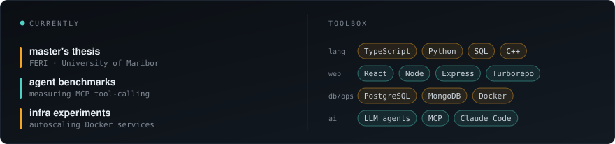

  <picture>
    <source media="(prefers-color-scheme: dark)" srcset="assets/header-dark.svg">
    <source media="(prefers-color-scheme: light)" srcset="assets/header-light.svg">
    
  </picture>

  <picture>
    <source media="(prefers-color-scheme: dark)" srcset="assets/now-dark.svg">
    <source media="(prefers-color-scheme: light)" srcset="assets/now-light.svg">
    
  </picture>

  <picture>
    <source media="(prefers-color-scheme: dark)" srcset="assets/panels-dark.svg">
    <source media="(prefers-color-scheme: light)" srcset="assets/panels-light.svg">
    
  </picture>

